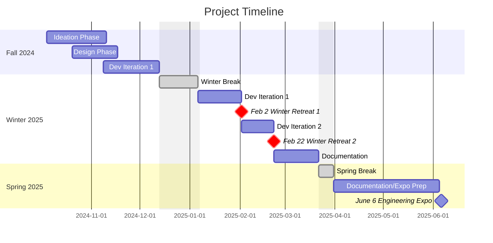

# Human-Robot Meditation Retreat: Development, Deployment, and Assessment
### Exploring the effectiveness of delivering mindfulness exercises through robots.


_Mini-Pupper 2 (left) and Pepper (right) robots were the main systems used for this project as pictured above._

This repository and its contents were developed as part of a Senior Capstone project at Oregon State University from September 2024 - June 2025, in collaboration with the CHARISMA Lab on campus. The project followed up on a 6-month robot-led meditation series from January – June 2024 by the CHARISMA Lab at OSU.

This repository is broken down into three main sections: [```retreat/```](./retreat/) contains documentation, setup, and code for each section of the retreat, [```moreInfo/```](./moreInfo/) has configuration and other important information, and [```futureWork/```](./futureWork/) contains our findings and work-in-progress ideation for future work on this project.


<!--Update as structure is changed-->
```
humanrobotretreat/
├── retreat/
│ ├── part1_welcome/
│ │ ... # folder for each section
│ ├── part8_end/ 
├── moreInfo/
│ ├── setup/ # getting started guides and helpful resources
├── futureWork/
```

# Why Robots?

Meditation and mindfulness practices have gained popularity in recent years, especially after the COVID-19 pandemic, which increased isolation and stress. While many automated meditation resources, such as apps or scripted videos, offer accessible guidance, they lack the dynamic and embodied interaction that is offered by in-person guided meditation. This project explored how leveraging the physical presence of robots can enhance meditation experiences beyond static, pre-recorded scripts.

## Target Audience
- Mindfulness practitioners
  - Stressed students
  - Busy Faculty
  - Visistors seeking relaxation
  - People seeking for new meditation methods/media
- Wellness retreat organizers
    - CHARISMA Lab
    - Capstone team
    - (See in Acknowledgements) 
- Human-robot interaction researchers
- Robot Enthusiasts
- Yoga Enjoyers

## Core Features
- Robot-led guided meditation with gestures, voice, and music
- Two robots with different body shapes displaying emotional and visual feedback to participants
  - Humanoid (Pepper)
  - Quadroped (Mini-Pupper)
- Real time, in-person voice and gesture additional guidance from the human facilitators
- Customizable meditation exercises using scripts and modular code

## Benefits

- Embodied presence: Physical presence of the robots and faculty increase the realism of the meditation compared to video/audio  
- Consistent delivery: Both robots were run with scripts that were revised and tested over multiple iterations of the retreat
- Increased accessibility: Robots can be more accessible for anyone who purchased or participated the retreat
- Higher engagement: Curiosity leads people to experience new way of meditation and explore the inner-workings of robotics at the same time
- Customizable interactions: The scripts we developed can be changed based on the needs of the sessions or groups
- Scalable deployment: Once refined, the robots can lead the exercises by themselves with little human-in-the-loop intervention


<!--This needs to be updated to just be important milestones, maybe a Gantt chart? -->
## Project Timeline & Milestones



# Acknowledgements

**Team Members:**
- Ben Ziegler – zieglben@oregonstate.edu
- KweonHo Park – parkkweo@oregonstate.edu
- Eliane Wang – wangel@oregonstate.edu
- Yen-Ting Chou – chouye@oregonstate.edu
- Jacob Strand – strandja@oregonstate.edu

**Project Partner:**
- Dr. Heather Knight - heather.knight@oregonstate.edu,
CHARISMA Robotics Lab


